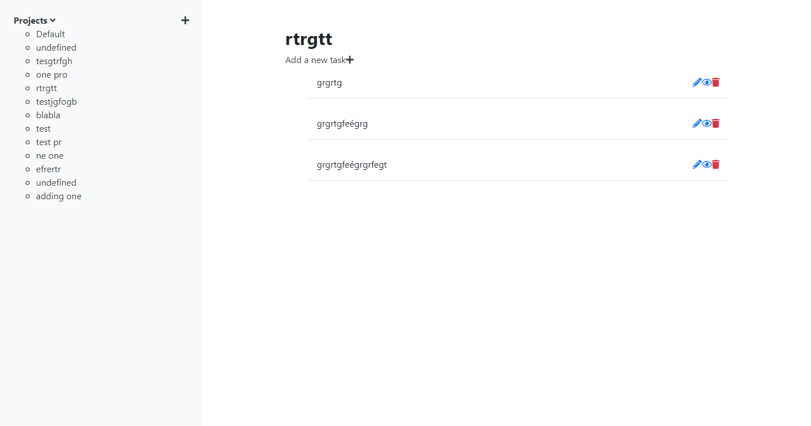

# Todo-List
This is the third project in the Microverse Javascript module. The goal of the project is to build a todo app with webpack, ES6 modules and classes.

## Project screenshot

## 🔨 Built in

- JavaScript
- Webpack
- Bootstrap 4

## 🚀 Our Project

Our project can be found at https://github.com/daviidy/to-do-list

## Live Demo

You can find the demo [here](https://daviidy.github.io/to-do-list/)

## To run the project in local

- make sure you have have NodeJS and NPM installed in your computer
- clone the repository from here [repo link](https://github.com/daviidy/to-do-list)
- navigate in your terminal to the folder `to-do-list`
- run `npm install`
- run `npx webpack`
- open index.html with your browser

## To run the tests
- npm run test

## 👨🏽‍💻 👨🏿‍💻 Creators

👤 **Author1**

- Github: [@daviidy](https://github.com/daviidy)
- Twitter: [@davidyao3](https://twitter.com/DavidYao3)
- LinkedIn: [@daviidy](https://www.linkedin.com/in/david-yao-6bb95299/)
- Personal Website: [@daviidy](http://david-yao.com)

👤 **Author2**

- Github: [@sinework](https://github.com/sinework)
- LinkedIn: [LinkedIn](https://www.linkedin.com/in/sinework-amare-shiferaw/)
- Twitter: [Twitter](https://twitter.com/SineworkAmare)

## 🤝 Contributing

Contributions, issues and feature requests are welcome!

## Show your support

Give a ⭐️ if you like this project!

## 📝 License

This project is no licensed.
